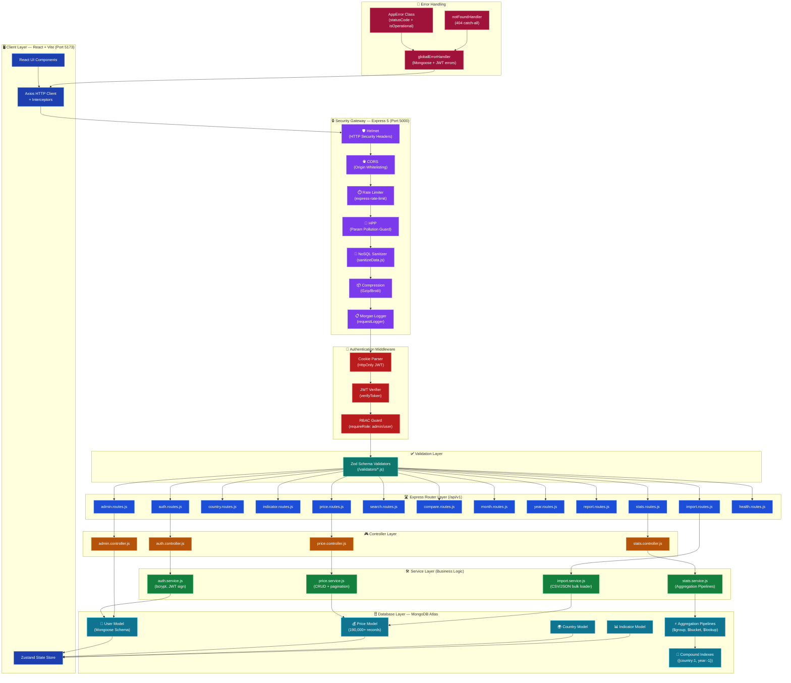
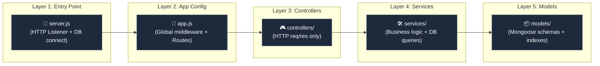
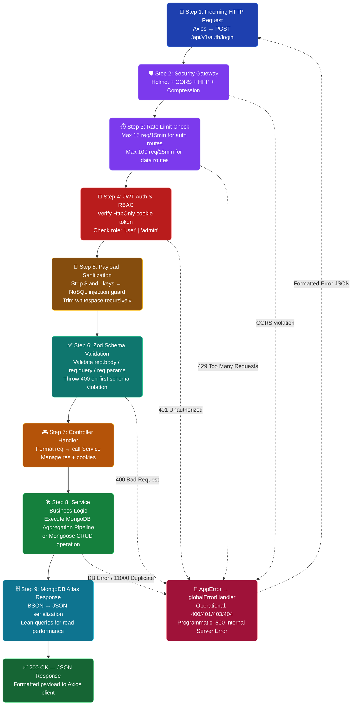
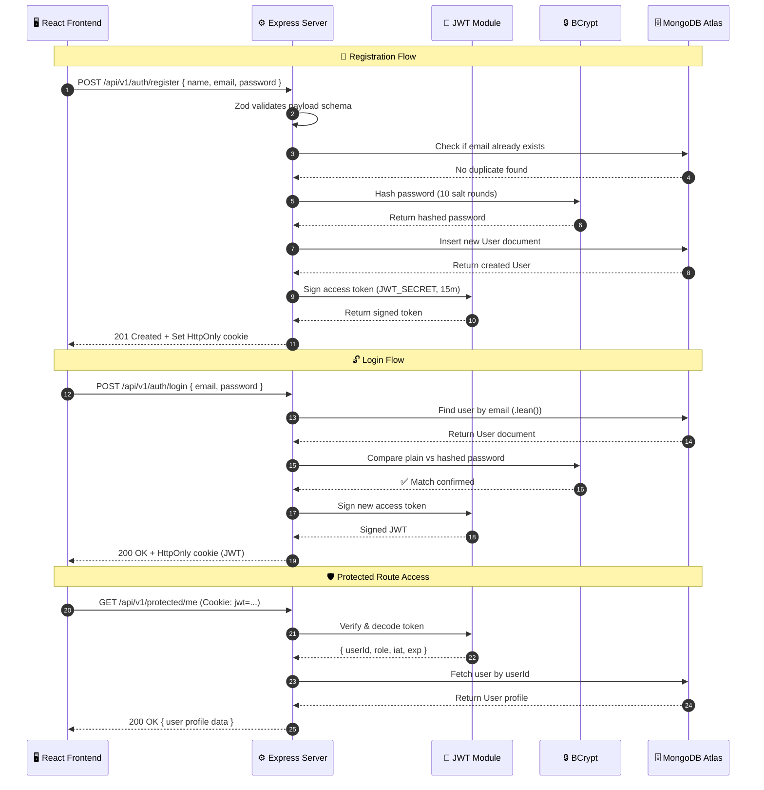
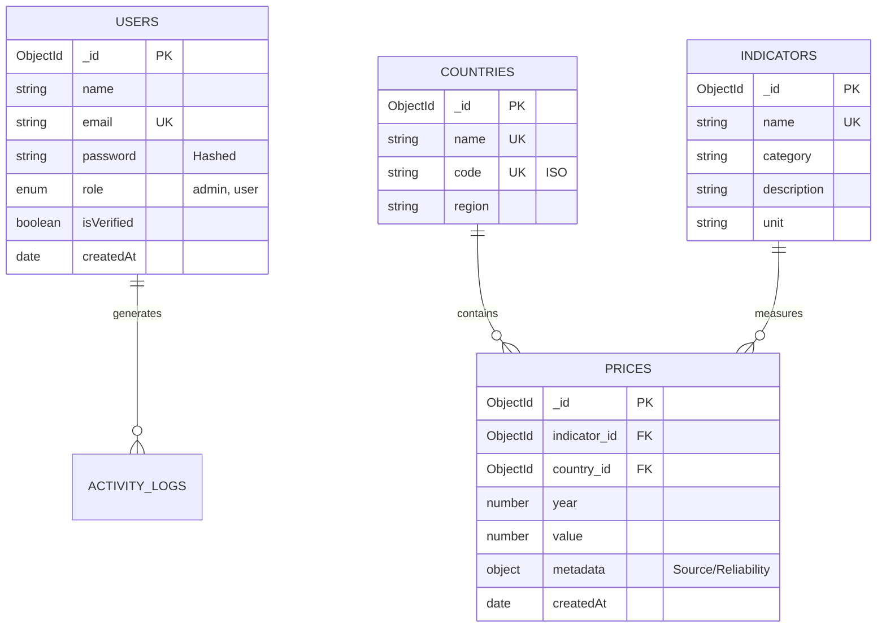

<div align="center">


# ⚙️ Human Capital Analytics | Backend Engine

**High-Performance MERN RESTful API, Advanced Aggregations & Security Orchestration Gateway**

[](https://nodejs.org/)
[](https://expressjs.com/)
[](https://www.mongodb.com/)
[](https://jwt.io/)
[](https://zod.dev/)
[](https://documenter.getpostman.com/view/50839186/2sBXqRiGpA)

<br/>

[](https://human-capital-project-sahoo-priyabrata.onrender.com)

> A strictly decoupled, enterprise-grade MVC backend engine built to deliver lightning-fast analytics over 190,000+ consumer price records using MongoDB Aggregation Pipelines and a hardened multi-layer defense system.

---

</div>

## 🏗️ Full-Stack System Architecture

The Human Capital Analytics backend is a fully decoupled, enterprise-grade Node.js engine. The diagram below illustrates the **complete system architecture** — from the React frontend all the way through to the MongoDB Atlas data layer:



---

## 🎯 MVC / Service Layer Architecture

The backend enforces strict **Separation of Concerns (SoC)** across 5 distinct layers:



### Key Engineering Features:
*   **📊 Native Aggregation Engine**: Dynamic pipelines calculating global macro-economic statistics, monthly averages, yearly trends, and geo-economic clustering.
*   **🛡️ Multi-Layer Security Controls**: Hardened with Helmet HTTP headers, CORS whitelisting, HTTP Parameter Pollution (`hpp`) defense, Custom NoSQL query injection sanitizers, and Rate-limiting.
*   **✅ Strict Payload Sanitization**: Fully typed runtime payload schema enforcement using **Zod** validator schemas.
*   **🛠️ Service-Oriented Logic**: Controllers only manage HTTP protocols (`req`, `res`, `cookies`). Core database operations and business logic are delegated to independent services.

---

## 🔄 Backend Request Lifecycle Workflow

Every API call passes through **9 sequential stages** before a response is returned. This ensures zero-trust security, clean validation, and optimal DB performance:



---

## 🔐 Authentication & Authorization Workflow



---

## 🗄️ Database Design & Entity Relationship Diagram

The backend acts as the custodian of data integrity. We utilize a highly normalized MongoDB schema enforced strictly via Mongoose ODMs and custom Zod validation layers.



### 📈 Compound Indexing Strategy

To handle analytical aggregations spanning millions of permutations over 190,000+ documents, we rely on advanced B-Tree compound indexing:

| Index | Collection | Purpose | Performance |
| :--- | :--- | :--- | :--- |
| `{ country: 1, year: -1 }` | `prices` | Geo-temporal timeline lookups | `O(log n)` |
| `{ indicator: 1, country: 1 }` | `prices` | Indicator grouping & clustering | `O(log n)` |

---

## 📈 Backend Data Processing Pipeline

When handling complex aggregations, the backend processes queries through a strict sequential pipeline to ensure high performance and data sanitization:


---

## 📊 Advanced MongoDB Aggregation Pipelines

Heavy statistical calculations are computed directly on the database engine using aggregation pipelines:

### 📅 Yearly Trend Pipelines
Used to map multi-year time-series indexes grouped by indicators and nations:
```javascript
[
  { $match: { country: countryCode, indicator: indicatorId } },
  {
    $group: {
      _id: "$year",
      averageValue: { $avg: "$value" },
      minVal: { $min: "$value" },
      maxVal: { $max: "$value" },
      count: { $sum: 1 }
    }
  },
  { $sort: { _id: 1 } },
  {
    $project: {
      year: "$_id",
      averageValue: 1,
      minVal: 1,
      maxVal: 1,
      count: 1,
      _id: 0
    }
  }
]
```

### 🌍 Geo-Clustering & Distribution Pipelines
Segments values into frequency buckets to build client distribution curves:
```javascript
[
  { $match: { indicator: indicatorId } },
  {
    $bucketAuto: {
      groupBy: "$value",
      buckets: 10,
      output: {
        count: { $sum: 1 },
        average: { $avg: "$value" }
      }
    }
  }
]
```

---

## 🛡️ Multi-Layer Security Architecture

### 🛑 Global API Rate Limiting (`middlewares/rateLimit.middleware.js`)

| Route Group | Limit | Window | Protection Against |
| :--- | :---: | :---: | :--- |
| Authentication (`/api/v1/auth`) | **15 requests** | 15 minutes | Brute-force login attacks |
| Data & Aggregation routes | **100 requests** | 15 minutes | API spam & scraping |
| Bulk Import route | **5 requests** | 1 minute | CPU exhaustion attacks |

### 🧹 Custom Payload Sanitizer (`utils/sanitizeData.js`)

| Threat | Method | Description |
| :--- | :--- | :--- |
| **NoSQL Injection** | Strip `$` and `.` keys | Prevents `{ $where: ... }` and similar query injection |
| **XSS via whitespace** | Recursive string trim | Strips leading/trailing whitespace from all string fields |

---

## 🚨 Error Handling Pipeline

The application features a centralized, synchronous-asynchronous error management engine:

### 1. `AppError` Utility Class
Extends JavaScript's native `Error` to append HTTP status codes and label errors as operational:
```javascript
class AppError extends Error {
  constructor(message, statusCode) {
    super(message);
    this.statusCode = statusCode;
    this.status = `${statusCode}`.startsWith('4') ? 'fail' : 'error';
    this.isOperational = true; // Operational failures (e.g. invalid inputs)
    Error.captureStackTrace(this, this.constructor);
  }
}
```

### 2. Global Error Handling Middleware (`middlewares/error.middleware.js`)
Intercepts thrown errors and formats clean response envelopes:

| Error Type | Source | HTTP Status | Response Message |
| :--- | :--- | :---: | :--- |
| `Mongoose Duplicate Key (11000)` | MongoDB | `400` | "Email is already registered" |
| `Mongoose ValidationError` | Mongoose | `400` | Collects all individual field messages |
| `JsonWebTokenError` | JWT | `401` | "Invalid token. Please log in again." |
| `TokenExpiredError` | JWT | `401` | "Your token has expired. Please log in again." |
| `Unhandled/Programmatic` | Runtime | `500` | "Something went wrong. Please try again." |

---

## ✅ Request Validation Pipeline (Zod Schemas)

All inputs (`req.body`, `req.query`, `req.params`) are validated prior to controller routing. Example schemas inside `/validators`:

```javascript
const { z } = require("zod");

// Register validation schema
const registerSchema = z.object({
  name: z.string().min(2, "Name must be at least 2 characters long"),
  email: z.string().email("Please provide a valid email format"),
  password: z.string()
    .min(8, "Password must be at least 8 characters long")
    .regex(/[a-z]/, "Password must contain at least one lowercase letter")
    .regex(/[A-Z]/, "Password must contain at least one uppercase letter")
    .regex(/[0-9]/, "Password must contain at least one number"),
  role: z.enum(["user", "admin"]).optional(),
});
```

---

## 📐 Strict Codebase Guidelines

To ensure code maintainability, this project enforces these development principles:

### 1️⃣ The 250-Line limit
*   **Mandatory Rule**: No controller, service, validator, or route file may exceed **250 lines of code**.
*   **Decomposition**: If files grow beyond this limit, developers must split them by extracting helper functions, utilities, or specific domain sub-handlers into separate files.

### 2️⃣ Lean Database Interfacing
*   **Optimization**: Use Mongoose `.lean()` on read-only queries to avoid expensive hydration overhead.
*   **Indexing**: Compound indices are strategically created (e.g., `{ country: 1, year: -1 }`) to keep read queries performing in `O(log n)`.

---

## 📂 System File Hierarchy

```text
backend/
├── ⚙️ config/                 # Database connectors and global infrastructure setups
├── 🎮 controllers/            # Route handler logic mapping HTTP queries to service calls
├── 🛡️ middlewares/            # Request parsing filters (JWT validation, RBAC, Errors)
├── 📦 models/                 # Mongoose schemas with compound indexes & pre-save hooks
├── 🛣️ routes/                 # Express versioned api endpoints (/api/v1)
├── 🛠️ services/               # Reusable core analytical algorithms and DB query handlers
├── 🔧 utils/                  # Helper utilities (Token generators, JSON formatters)
├── ✅ validators/             # Zod input schemas enforcing strict data validation
├── 🚀 app.js                  # Global Express app definition with security middleware
└── 🏁 server.js               # Application entry point hosting the HTTP listener
```

---

## 📡 API Endpoint Architecture

### 🔐 Authentication (`/api/v1/auth`)
| Method | Endpoint | Auth | Description |
| :--- | :--- | :---: | :--- |
| `POST` | `/register` | ❌ | Creates a new user profile with Zod-validated payload |
| `POST` | `/login` | ❌ | Validates credentials, issues JWT & sets secure HttpOnly cookie |
| `POST` | `/logout` | ✅ | Invalidates active server session and clears cookie |
| `POST` | `/send-otp` | ❌ | Sends OTP to registered email for verification |
| `POST` | `/verify-otp` | ❌ | Verifies OTP token for security operations |
| `PATCH` | `/change-password` | ✅ | Centralized authenticated password update pipeline |

### 📊 Prices Data Grid (`/api/v1/prices`)
| Method | Endpoint | Auth | Description |
| :--- | :--- | :---: | :--- |
| `GET` | `/` | ✅ | Fetches economic records with cursor pagination, sorting & filters |
| `GET` | `/:id` | ✅ | Fetches a single price record by MongoDB ObjectId |
| `GET` | `/trending` | ✅ | Lists the most volatile price movements across indicators |
| `POST` | `/` | 🔒 Admin | Creates a new price record (admin only) |
| `PATCH` | `/:id` | 🔒 Admin | Updates an existing price record (admin only) |
| `DELETE` | `/:id` | 🔒 Admin | Deletes a price record (admin only) |

### 🌍 Territories & Countries (`/api/v1/countries`)
| Method | Endpoint | Auth | Description |
| :--- | :--- | :---: | :--- |
| `GET` | `/` | ✅ | Retrieves a paginated list of all unique countries |
| `GET` | `/search` | ✅ | Searches specific countries by name or ISO code |
| `GET` | `/:code/stats` | ✅ | Pulls historical macroeconomic data for a specific country |

### 🏷️ Indicators (`/api/v1/indicators`)
| Method | Endpoint | Auth | Description |
| :--- | :--- | :---: | :--- |
| `GET` | `/` | ✅ | Lists all available economic indicators with metadata |
| `GET` | `/:id` | ✅ | Fetches a single indicator definition by ID |
| `POST` | `/` | 🔒 Admin | Creates a new economic indicator (admin only) |
| `PATCH` | `/:id` | 🔒 Admin | Updates indicator metadata (admin only) |
| `DELETE` | `/:id` | 🔒 Admin | Removes an indicator (admin only) |

### 🔍 Global Search (`/api/v1/search`)
| Method | Endpoint | Auth | Description |
| :--- | :--- | :---: | :--- |
| `GET` | `/` | ✅ | Full-text cross-collection search across countries, indicators & prices |

### 📈 Analytics & Aggregations (`/api/v1/stats`)
| Method | Endpoint | Auth | Description |
| :--- | :--- | :---: | :--- |
| `GET` | `/prices` | ✅ | Global aggregated statistics summaries (min, max, avg, count) |
| `GET` | `/monthly-avg` | ✅ | MongoDB pipeline: indices grouped & averaged by month |
| `GET` | `/yearly-avg` | ✅ | Aggregated historical index averages grouped by calendar year |
| `GET` | `/distribution` | ✅ | Frequency distribution of index value ranges (bucket aggregation) |

### 📅 Monthly Trends (`/api/v1/months`)
| Method | Endpoint | Auth | Description |
| :--- | :--- | :---: | :--- |
| `GET` | `/` | ✅ | Retrieves monthly time-series aggregations for charting |
| `GET` | `/:year` | ✅ | Fetches monthly breakdown filtered by a specific year |

### 📆 Yearly Trends (`/api/v1/years`)
| Method | Endpoint | Auth | Description |
| :--- | :--- | :---: | :--- |
| `GET` | `/` | ✅ | Retrieves full year-over-year trend data across all indicators |
| `GET` | `/:year` | ✅ | Fetches aggregated data for a specific calendar year |

### 🔄 Comparative Analytics (`/api/v1/compare`)
| Method | Endpoint | Auth | Description |
| :--- | :--- | :---: | :--- |
| `GET` | `/countries` | ✅ | Side-by-side comparison of indicators across multiple countries |
| `GET` | `/indicators` | ✅ | Cross-indicator comparison for a single country over time |

### 📄 Reports (`/api/v1/reports`)
| Method | Endpoint | Auth | Description |
| :--- | :--- | :---: | :--- |
| `GET` | `/` | ✅ | Lists all generated analytical reports |
| `POST` | `/generate` | ✅ | Triggers server-side report generation for selected filters |
| `GET` | `/:id` | ✅ | Downloads/previews a specific generated report |

### 📥 Bulk Import (`/api/v1/import`)
| Method | Endpoint | Auth | Description |
| :--- | :--- | :---: | :--- |
| `POST` | `/csv` | 🔒 Admin | Bulk imports price records from a CSV file (rate-limited: 5 req/min) |
| `POST` | `/json` | 🔒 Admin | Bulk imports price records from a JSON payload |

### 🔑 JWT Utilities (`/api/v1/jwt`)
| Method | Endpoint | Auth | Description |
| :--- | :--- | :---: | :--- |
| `POST` | `/refresh` | ✅ | Issues a fresh access token using the stored HttpOnly cookie |
| `POST` | `/validate` | ✅ | Validates and decodes an active JWT token |

### 🔐 Protected Routes (`/api/v1/protected`)
| Method | Endpoint | Auth | Description |
| :--- | :--- | :---: | :--- |
| `GET` | `/me` | ✅ | Returns the authenticated user's profile and roles |
| `PATCH` | `/me` | ✅ | Updates the authenticated user's own profile data |

### 🛠️ Admin Panel (`/api/v1/admin`)
| Method | Endpoint | Auth | Description |
| :--- | :--- | :---: | :--- |
| `GET` | `/users` | 🔒 Admin | Lists all registered users with metadata |
| `PATCH` | `/users/:id/role` | 🔒 Admin | Promotes or demotes a user's role |
| `DELETE` | `/users/:id` | 🔒 Admin | Permanently deletes a user account |
| `GET` | `/stats` | 🔒 Admin | Returns platform-wide usage statistics |

### 🧠 System Diagnostics (`/api/v1/health`)
| Method | Endpoint | Auth | Description |
| :--- | :--- | :---: | :--- |
| `GET` | `/` | ❌ | Returns uptime, microservice status & DB connection readiness |

> **Legend**: ✅ = JWT Required &nbsp;|&nbsp; 🔒 Admin = Admin RBAC Role Required &nbsp;|&nbsp; ❌ = Public

---

## 📦 Dependencies

### Production Dependencies
| Package | Version | Purpose |
| :--- | :---: | :--- |
| `express` | ^5.2.1 | Core HTTP web framework (Express 5 with async error support) |
| `mongoose` | ^9.6.2 | MongoDB ODM with schema validation & compound indexing |
| `jsonwebtoken` | ^9.0.3 | Stateless JWT generation and verification |
| `bcryptjs` | ^3.0.3 | Password hashing with configurable salt rounds |
| `zod` | ^4.4.3 | Runtime schema validation for request payloads |
| `helmet` | ^8.1.0 | Sets secure HTTP response headers (CSP, XSS, HSTS etc.) |
| `cors` | ^2.8.6 | Cross-Origin Resource Sharing with origin whitelisting |
| `express-rate-limit` | ^8.5.1 | Per-IP rate limiting to prevent DDoS attacks |
| `hpp` | ^0.2.3 | HTTP Parameter Pollution prevention middleware |
| `cookie-parser` | ^1.4.7 | Parses incoming cookie headers for JWT extraction |
| `compression` | ^1.8.1 | Gzip/Brotli response compression for network optimization |
| `morgan` | ^1.10.1 | HTTP request logger middleware (dev + combined modes) |
| `dotenv` | ^17.4.2 | Loads environment variables from `.env` into `process.env` |

### Development Dependencies
| Package | Version | Purpose |
| :--- | :---: | :--- |
| `nodemon` | ^3.1.14 | Auto-restarts server on file changes during development |
| `eslint` | ^10.3.0 | Static code analysis and style enforcement |
| `prettier` | ^3.8.3 | Opinionated code formatter for consistent style |
| `jest` | ^30.4.2 | JavaScript testing framework for unit & integration tests |

---

## ⚡ Quick Start Guide

### 1️⃣ Install Dependencies
Ensure you have Node.js v20+ installed. Run the command at the root of the backend directory:
```bash
npm install
```

### 2️⃣ Configure Environment Variables
Duplicate `.env.example` to `.env` and configure all credentials:

| Variable | Required | Default | Description |
| :--- | :---: | :--- | :--- |
| `PORT` | ✅ | `5000` | HTTP port the Express server listens on |
| `NODE_ENV` | ✅ | `development` | Runtime environment (`development` \| `production`) |
| `MONGODB_URI` | ✅ | — | MongoDB Atlas connection string for production |
| `LOCAL_MONGODB_URI` | ⚠️ Dev | — | Local MongoDB URI for development (`127.0.0.1:27017`) |
| `JWT_SECRET` | ✅ | — | Secret key for signing & verifying JWT tokens (min 32 chars) |
| `JWT_EXPIRES_IN` | ✅ | `15m` | JWT access token expiry duration (e.g. `15m`, `1h`, `7d`) |
| `CLIENT_URL` | ✅ | — | Frontend origin URL whitelisted in CORS policy |

```env
# .env — Copy this to your .env file and fill in the values
PORT=5000
NODE_ENV=development

# Database
LOCAL_MONGODB_URI=mongodb://127.0.0.1:27017/humanCapitalDB
MONGODB_URI=mongodb+srv://<user>:<password>@cluster0.mongodb.net/human_capital_analytics

# JWT Authentication
JWT_SECRET=super_secret_jwt_key_for_human_capital_api_2026
JWT_EXPIRES_IN=15m

# CORS
CLIENT_URL=http://localhost:5173
```

### 3️⃣ Start Development Server
Boots Node with Nodemon for hot reloading:
```bash
npm run dev
```

---

## 🕹️ Command Reference

| Command | Environment | Purpose |
| :--- | :--- | :--- |
| `npm start` | **Production** | Runs the compiled production code. |
| `npm run dev` | **Development** | Runs the development listener via Nodemon. |
| `npm run lint` | **Quality** | Runs ESLint analysis over `/src`. |
| `npm run format` | **Quality** | Formats code layout using Prettier. |
| `npm run test` | **Testing** | Runs Jest unit and integration tests. |

---

<div align="center">

### 📖 Interactive Testing & Complete API Reference
[](https://documenter.getpostman.com/view/50839186/2sBXqRiGpA)

---

## 📜 License

Distributed under the **MIT License**. See [LICENSE](file:///c:/Users/priyabrata/Desktop/Human_Capital/human_capital_project_sahoo_priyabrata/LICENSE) for more details.

<p align="left">
  <a href="https://opensource.org/licenses/MIT">
    
  </a>
</p>

---

## 👨‍💻 Developer & Author

<table align="center" style="border: none; background: transparent; border-collapse: collapse;">
  <tr style="background: transparent; border: none;">
    <td align="center" style="border: none; padding: 24px;">
      <a href="https://github.com/priyabratasahoo780">
        
      </a>
      <br /><br />
      <strong style="font-size: 1.25rem; color: #f8fafc;">Priyabrata Sahoo</strong>
      <br />
      <span style="color: #94a3b8; font-size: 0.95rem;">Full-Stack Software Engineer & Platform Architect</span>
    </td>
  </tr>
  <tr style="background: transparent; border: none;">
    <td align="center" style="border: none; padding-bottom: 24px;">
      <a href="https://github.com/priyabratasahoo780" target="_blank">
        
      </a>
      &nbsp;&nbsp;
      <a href="https://www.linkedin.com/in/priyabrata-sahoo/" target="_blank">
        
      </a>
    </td>
  </tr>
</table>

---

<div align="center">

<h3>🚀 Deciphering global datasets securely with low-latency APIs.</h3>

<br />

<a href="#-human-capital-analytics--backend-engine">
  
</a>

</div>
